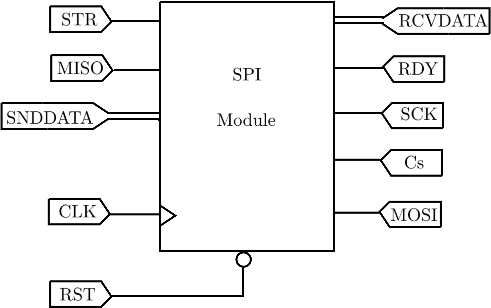
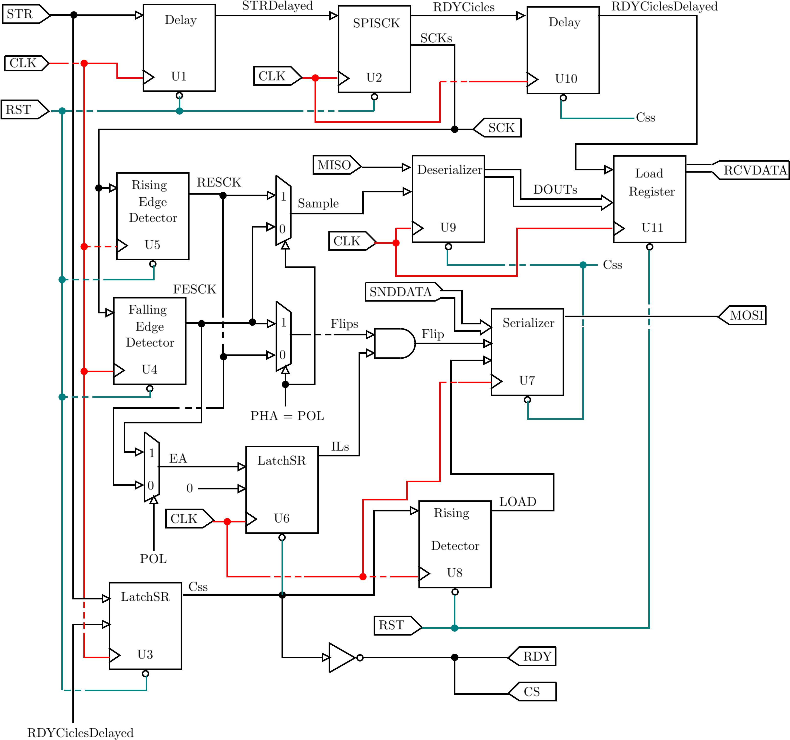

# SPI Module  

## Description:
This SPI implementation can receive and send data through MISO and MOSI with the following characteristics selection.

- 4 mode polarity and phase.
- SCK number of cicles and frequency.
- Data width.

Entity consists of 5 inputs and 5 outputs as shown below. 

The clock signal net is shown in red, reset signal is shown in aqua. Thin signals correspond to a width of 1 bit, thick signals to a width of n bits. 

